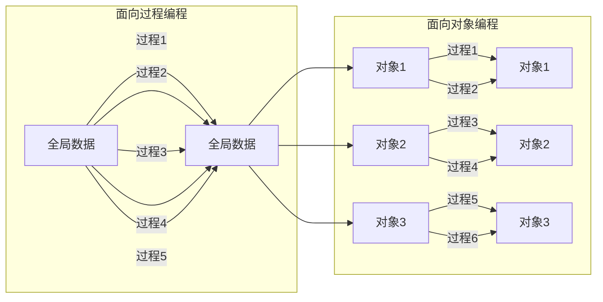

### 对象与类
如下所示，可看出面向对象编程的某个优势：

**调试：**
+ 若全局数据中的某个数据出错，需要调试5个方法。
+ 若某个对象的某个数据出错，只需要调试2个方法。

#### 类
1. 类是**构造对象**的**模板**：
    + 定义对象的**数据**
    + 定义对象的**方法**。
2. **创建实例**：由类**构造对象的过程**成为创建类的实例(instance)。
3. 对象
    + **实例域**：对象中的**数据**称为实例域(instance filed)。
    + **方法**：**操纵**数据的**过程**称为方法(method)。
    + **状态**：对象的实例域**值的集合**就是对象的**当前状态**(state)。

4. **封装**：形式上是1、2，关键是3。
    1. 将**数据和行为**组合在一个包。
    2. **隐藏**数据的**实现方式**。
    3. 绝对**不能让其他类**的方法**直接地**访问*本类实例域*。
    >程序**仅通过**对象的方法与对象的数据进行交互。
5. **继承**(inheritance)：可以通过继承来扩展一个类以提供更加丰富与具体的功能。
    1. 扩展的类**自动具有**所扩展类的全部属性与方法。
    2. 扩展的类可以**添加**新的数据域和新的方法
    3. 扩展的类还可以**覆盖**从所扩展的类继承的**方法**，使其更强大或更有针对性。
#### 对象
对象有三个主要特性：
+ 对象的**行为**(behavior)————可以对对象施加那些操作。
+ 对象的**状态**(state)————当施加方法时，对象如何相应。
+ 对象的**标识**(identity)————如何辨别具有相同行为与状态的不同对象。

这些关键特性之间互相影响：例如状态影响行为，行为改变状态。

#### 类
类之间的关系
+ 依赖("user-a")
+ 聚合("has-a")
+ 继承("is-a")

