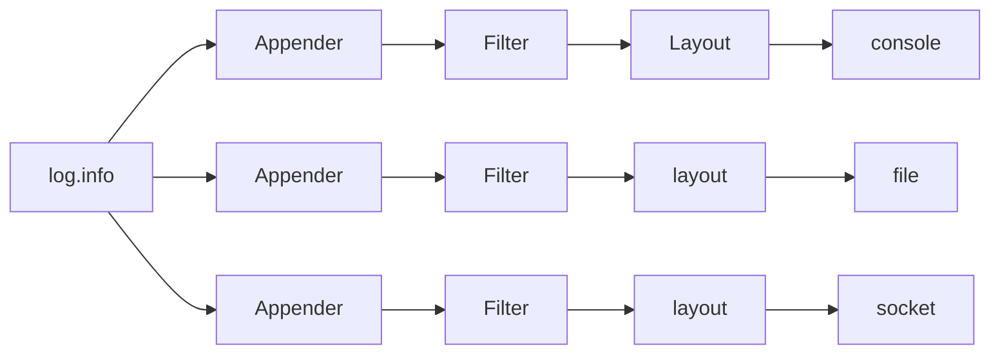

### Log4j
实际上常常这样做：commons log 作为"日志接口",而Log4j作为“日志实现”。
Log4j是一种非常流行的日志框架，最新版本是2.x。
Log4j是一个**组件化设计**的日志系统，它的架构大致如下：


#### 日志处理过程
当使用Log4j输出一条日志时，
1. 自动通过不同的`Appender`把**同一条**日志输出到**不同的目的地**。
    + console:输出到控制台
    + file:输出到文件
    + socket：通过网络输出到远程计算机
    + jdbc:输出到数据库
2. 使用Filter过滤日志记录，只有通过过滤的日志记录才会被输出
3. 通过Layou来格式化日志信息。例如自动添加日期、时间、方法名等信息

#### 配置文件
上述日志处理过程虽然负载，但在实际使用Log4j时候，并不需要关心Log4jd的API,而是**通过配置文件来配置**。

将`log4j2.xml`文件放到`classpanth`就可以然Log4j读取配置文件并按照配置来输出日志。

配置文件如下：
```xml
<?xml version="1.0" encoding="UTF-8"?>
<Configuration>
    <Properties>
        <!--定义日志格式-->
        <Property name="log.pattern">%d{MM-dd-HH:mm:ss.SSS}[%t]%-5level%logger{36}%n%msg%n%n</Property>
        <!--定义文件名变量-->
        <Property name="file.err.filename">log/err.log</Property>
        <Property name="file.err.pattern">log/err.%i.log.gz</Property>
    </Properties>

    <!--定义Appender,即目的地-->
    <Appenders>
        <!--定义输出到屏幕-->
        <Console name="console" target="SYSTEM_OUT">
            <!--日志格式引用上面定义的log.pattern-->
            <PatternLayout pattern="${log.pattern}"/>
        <Console>
        <!--定义输出到文件，文件名引用上面定义的file.err.filename-->
        <RollingFile name="err"  bufferedIO="true" fileNmae="${file.err.filename}" filePattern="${file.err.pattern}">
            <PatternLayout pattern="%{log.pattern}"/>
            <Policies>
                <!--根据文件大小自动切割日志-->
                <sizeBasedTriggeringPolicy size="1 MB"/>
            </Policies>
            <!--保留最近10分-->
            <DefualtRolloverStrategy max="10"/>
        </RollingFile>
    </Appenders>

    <Loggers>
        <Root level="info">
            <!--对info级别的日志，输出到consoel-->
            <AppenderRef ref="console" level="info"/>
            <!--对error级别的日志，输出到err-->
            <AppenderRef ref="err" level="error"/>
        </Root>
    </Loggers>
</Configuration>

```

#### jar包依赖
有了配置文件还不够，因为Log4j也是一个第三方库，我们需要从这里下载Log4j，解压后，把以下3个jar包放到classpath中：
+ log4j-api-2.x.jar
+ log4j-core-2.x.jar
+ log4j-jcl-2.x.jar


#### 最佳实践
在开发阶段，始终使用Commons Logging接口来写入日志，并且开发阶段无需引入Log4j。如果需要把日志写入文件， 只需要把正确的配置文件和Log4j相关的jar包放入classpath，就可以自动**把日志切换成使用Log4j写入，无需修改任何代码**。

### 为解决问题
写入到文件失败
