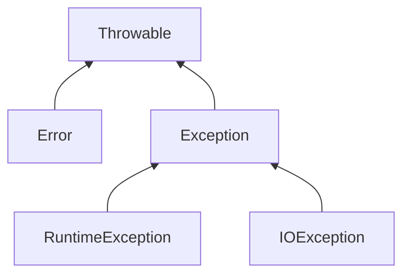

### 异常层次


+ 所有异常都是由`Throwable`继承而来
+ `Error`类层次描述了Java运行时系统的**内部错误**和**资源耗尽错误**。
+ `RuntimeException`类层次描述了**程序错误**导致的异常
+ `IOException`类层次描述了**I/O错误**之类异常。

### 受查异常与非受查异常
编译器将**检查**是否为所有的受查异常提供了**异常处理器**。
+ 非受查异常：`Error`以及`RuntimeException`类继承层次的所有异常
+ 受查异常：`Throwable`,`Exception`,以及`IOException`的继承层次

### 抛出异常的情况
1. 调用一个**抛出异常的方法**。
2. 使用`throw`语句**抛出异常**。(发现程序错误，)
3. 程序出现错误。(`RuntimeException`)
4. java虚拟机和运行时库出现的**内部错误**。(`Error`)


### 声明受查异常
方法应该在首部**声明所有可能**抛出的**受查异常**。
+ 实际应该声明前2种情况抛出的异常。
+ 第3种异常应该通过精心编写代码来避免。
+ 第4中异常不是程序员应该能处理的问题。

**`throws`关键字声明抛出的异常：**
```java
public void throw1() throws IOException //声明一个受查异常
{...}
public void throwN() throws FileNotFoundException, EOFException//声明多个受查异常，异常之间用逗号隔开
{...}

```
如果一个方法抛出异常对象，运行时系统就会开始搜索异常处理器，如果没有处理器捕获这个异常，当前**线程就会结束**。

### 抛出异常
抛出异常就是抛出一个异常对象。
**使用`throw`关键字抛出一个异常对象**。
1. 找到或创建一个合适的异常类
2. 创建这个类的一个对象
3. 将对象抛出

**注意:** 显然方法需要声明异常。
```java
public void throwException()throws IOException
{
    ...
    if(...)
        throw new IOException();    //抛出一个异常对象
    ...
}
```

### 创建异常类
+  **只需要派生`IOException`类**。派生其他异常不应该是程序员的工作。
+  包含**两个构造器**
    + 默认构造器。
    + 带有详细描述信息的构造器。(超类toString可以打印这些信息)
```java
class FileFormatException extends IOException
{
    public FileFormatException(){
        super();
    }
    public FileFormatException(String message){
        super(message);
    }
}
```

### 捕获异常

**try/catch语句捕获并处理异常:**
+ try语句块抛出的异常可被catch语句捕获，
+ 在catch语句快捕获指定异常，可在catch语句块提供异常处理。
+ 一个catch语句快可以**捕获多个异常**。此时异常变量为**final**，不可再赋值。
+ 可以提供**多个catch语句块**捕获多个异常。

**捕获处理步骤:**
1. 跳过try语句块剩余代码。
2. 执行catch子句的处理器代码。

**捕获异常的情况:**
+ 应该**捕获知道如何处理**的异常
+ 将不知道如何处理的异常继续传递。
+ **不允许子类方法**的throws说明符中出现**超过超类方法**所列出的**异常范围**。

**注意:** 捕获异常，意味异常不会再被抛出方法外，**故不再需要声明异常**。

```java
    try{
        code that might throw exceptiosn
    }catch(FileNotFountException | UnkonwedHostException e){
        //捕获多个异常
    }catch( IOException e){
        //再捕获一个异常
    }
```
### 再次抛出与异常链
再次抛出：在**catch子句**中可以**抛出一个异常**。
目的： **改变**异常的**类型**。
两种方法：
1. 直接抛出新异常
2. 将旧异常设置为新异常的原因，再抛出新异常。
比较优劣
1. 方法2可以让上层获取原始异常
2. 可以将不允许抛出的异常包装成运行时异常。
```
try{...
}catch(yyyException e){ 
    ...
    throw new xxxException();   //直接抛出新异常
}

try{...
}catch(yyyException e){ 
    ...
    throw new xxxException().initCause(e);   //将旧异常设置为原因，然后抛出新异常
}

//获取旧异常
yyyExceptione ye = e.getCause();
```

### finally子句
+ `finally`子句位于try/catch语句的**最后位置**。
+ `finally`子句不管是否有异常被捕获，`finally`子句中的代码都被执行。
+ `finally`子句在catch子句**执行完毕**或catch子句**抛出异常后**执行。

故使用finally子句关闭资源，比即在正常代码关闭资源又在异常代码关闭资源，的处理方法高效得多。而且不需要捕获所有异常。而且可以应对catch子句也抛出异常的情况。

**解耦try/catch和try/finally**语句块，可以提高代码的清晰度

**注意return:** 
+ 如果try语句块中执行return语句，那么在方法返回前会执行finally子句
+ 如果finally语句中**也有一个return语句**，则这个返回值会覆盖原始的返回值。

**注意finally子句抛出异常:**
+ 清理资源的方法**也可能抛出异常**。
+ 此时**原始异常将会丢失**，转而抛出清理资源抛出的异常。

```java
try{
    try{
        //内层确保关闭资源
    }finally{

    }
}catch(IOException e)
{
    //外层确保捕获异常
}

try{

}catch(IOException e){

}finally{
    //可以捕获catch子句的异常，不过对于finally子句意义不大，即对关闭资源意义不大。
    //所以没有必要在意这个附加功能，建议使用上述解耦的语句
}

```
### 带资源的try语句
带资源的try语句可以解决**finally子句抛出异常的问题**。
+ **要求资源属于实现了`AutoCloseable`接口的类**。该接口包含方法`void close() throws Exception
+ `Closeable`接口属于`AutoCloseable`接口的子类，其close方法抛出IOException.
+ 带资源的try语句可以**指定多个资源**。
+ 带资源的try语句**退出时自动**调用close()方法**关闭资源**。(无论正常退出还是异常退出)
+ 如果**清理资源的方法抛出异常**，带资源的try语句自动调用addSuppressed方法将清理资源的异常**抑制到原始异常**，然后重新**抛出原始异常**。
+ 可以调用`getSuppressed`方法获取被"抑制"的异常。
+ 带资源的try语句也可以有**catch语句和finally语句**。这些语句在**关闭资源后**执行。

### 分析堆栈轨迹元素
堆栈轨迹(stack trace)是一个方法调用过程的列表，包含了程序执行过程中方法调用的特定位置。
```java
//Throwable的printStackTrace方法返回堆栈轨迹的文本描述信息
Throwable t = new Throwable();
StringWriter out = new StringWriter();
t.printStackTrace(new PrintWriter(out));
String description = out.toString();

//分析StackeTraceElement对象
Throwable t= new Throwable();
StackTraceElement[] frames = t.getStackTrace();
for(StackTraceElement frame : frames)
{
    String file = frame.getFileName();
    int number = frame.getLineNumber();
    String cl = frame.getClassName();
    String me = frame.getMethodName();
    boolean bool = frame.isNativeMethod();
    String str = frame.toString();//类名，方法名，文件名，行数的格式字符串
}

//Thread类的静态方法产生所有线程的堆栈轨迹
Map<Thread, StackTraceElement[]> map = Thread.getAllStackTraces();
for(Thread t : map.keySet())
{
    StackTraceElement[] frames = map.get(t);
    .....
}
```

### 小结
1. 抛出异常的情况
    + 调用声明抛出异常的方法。（即方法用`throws`语句声明抛出异常）
    + 方法抛出异常，即发现错误后用`throw`抛出一个异常对象。
    + 程序出现错误。这种情况是指`RuntimeException`,这种异常可以通过修正代码来改变。
    + Java虚拟机或运行时系统的内部错误或内存耗尽异常。这种情况是`Error`异常，不受程序员控制
2. 受查异常与非受查异常
    + 编译会检查为所有受查异常提供异常处理器。
    + 继承与`Error`和`RuntimeException`异常的继承层次是**非受查异常**。
    + 其余异常则是**受查异常**。
    >说明：非受查异常要么是程序不可处理的`Error`,要么就是程序错误，这类可以在程序编码阶段就确定的错误。
    >而受查异常则是依赖于运行环境。程序本身没有错误。例如IO设备被占用，文件读取失败。
3. 可能需要声明抛出异常的情况：应该只声明抛出**受查异常**，在**方法首部添加`thorws`关键与异常列表**(即不同异常之间用逗号隔开)。
    + 调用声明抛出异常的方法
    + 方法抛出异常。
    >说明：这两种情况都是抛出受查异常，所以需要声明抛出异常。实例如下所示
    >```
    >void method() throws xxExcpeiton, yyException 
    >{...}
    >````
4. 捕获异常：如果可以处理异常就可捕获异常，**而不用再声明抛出异常**。（即传递异常）
    + try/catch 捕获异常
        + 可以由多个catch语句
        + catch语句可以捕获多个异常，
        + catch语句捕获多个异常时候，**异常变量为final变量**。
    + finally 子句
        + finally语句无论try语句块是否发生异常，都会在**最后执行**。
        + finally语句添加在try/catch语句后面，有了finally语句可以不要catch子句。
        + finally语句常用来**清理资源**。
        + ** 建议解耦**try/finally，try/catch语句，区分捕获异常和清理资源的任务。
        >```java
        > try{
        >    try{}
        >    }finally{
        >        //清理资源
        >    }
        >}catch{
        > //捕获异常
        >}
        >```
    + 带资源的try语句
        + 带资源的try语句可以**自动清理资源**(资源实现AutoClose接口，close方法)。
        + 带资源的try语句可以在清理资源抛出异常时候，**抑制清理异常(addSupressed)到原始异常**，而抛出原始异常。而finally子句不能自动处理。
        + 可以调用`getSupressed`方法获取被抑制的异常
        + 带资源的try语句可以同时声明**多个资源**。
        >```java
        >try(Resource1 var = new Resource1(...); Resou2 var2= ...){
        >    
        >}
        >
5. 再次抛出异常：目的是改变异常类型。
    + `initCause()`方法将旧异常作为新异常的原因
    + `getCause()`从新异常获取旧异常
    + 改变异常类型，往往发生在**不需要**过多关注**子系统**异常**细节**，而只需要**知道存在异常**的情况下。
    + 伪装异常：子类方法不允许声明抛出超过超类方法异常范围(即不能超出其继承层次)
6. 分析堆栈元素：`StackTraceElement`是方法调用过程的列表的元素
    + `Throwable`类的`getStackTrace()`获得构造这个对象是调用堆栈的跟踪。
    + `Throwable`类`printStackTrace(PrintWriet)`输出堆栈轨迹的文本描述
    + 静态的`Thread.getAllStackTrace()`返回所有线程的堆栈轨迹，返回值是一个**以线程为建，堆栈元素组为值的映射**。
7. `StackTractElement` 堆栈轨迹元素,下面方法返回元素运行时对应的信息
    + `String getFileName()`
    + `int getLineNumber()`
    + `String getClass()`
    + `String getMethods()`
    + `Boolean isNativemethod()`
    + `String toString()` 包含类名，方法名，文件名，行数的格式化字符串。